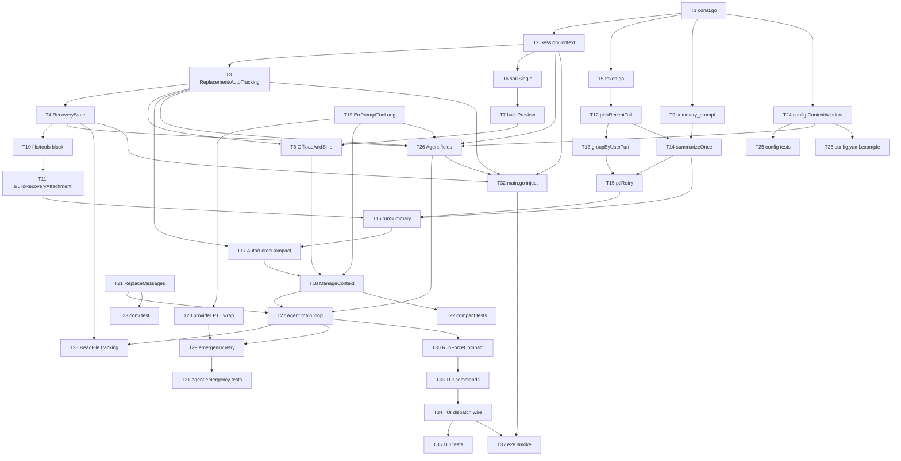

# 上下文管理 Tasks

本章把"两层压缩 + 压缩后恢复 + 手动 / 紧急入口"按 plan 的模块切分落到代码上。任务粒度控制在 2~5 分钟一个，每个任务都自包含：可以读完任务直接动手，不需要回看 plan。任务之间通过"依赖"字段标明顺序。

## 文件清单

| 文件路径 | 类型 | 职责 |
|----------|------|------|
| `internal/compact/const.go` | 新建 | 全部硬编码常量 |
| `internal/compact/state.go` | 新建 | `ContentReplacementState`（含 `DecideOnce`）/ `AutoCompactTrackingState` / `RecoveryState` / `SessionContext` |
| `internal/compact/token.go` | 新建 | `EstimateTokens` / `UsageAnchor` / `messageChars` |
| `internal/compact/layer1.go` | 新建 | `OffloadAndSnip` / `spillSingle` / `buildPreview` |
| `internal/compact/summary_prompt.go` | 新建 | `BuildSummaryPrompt` / `serializeConversation` / `ExtractSummary` / 9 部分模板 |
| `internal/compact/recovery.go` | 新建 | `BuildRecoveryAttachment` / `renderFileBlock` / `renderToolsBlock` / `boundaryNotice` |
| `internal/compact/layer2.go` | 新建 | `AutoCompact` / `ForceCompact` / `runSummary` / `summarizeOnce` / `ptlRetry` / `pickRecentTail` / `groupByUserTurn` |
| `internal/compact/compact.go` | 新建 | `ManageContext` / `TriggerKind` 枚举 / 编排 |
| `internal/compact/*_test.go` | 新建 | 各文件对应单测 |
| `internal/llm/provider.go` | 修改 | 新增 `ErrPromptTooLong` 哨兵错误（`ToolDefinition` 已是导出类型，无需改动） |
| `internal/llm/anthropic.go` | 修改 | 把 provider 上下文过长错误包装成 `ErrPromptTooLong` 并通过 `StreamEvent.Err` 投递 |
| `internal/llm/openai.go` | 修改 | 同上 |
| `internal/llm/anthropic_test.go` | 修改/新建 | PTL 错误包装单测 |
| `internal/llm/openai_test.go` | 修改/新建 | PTL 错误包装单测 |
| `internal/conversation/conversation.go` | 修改 | 加 `mu sync.Mutex`；新增 `ReplaceMessages(msgs)` 深拷贝整体替换 |
| `internal/conversation/conversation_test.go` | 修改 | 增加 `ReplaceMessages` 用例 |
| `internal/config/config.go` | 修改 | `ProviderConfig` 追加 `ContextWindow int` + `EffectiveContextWindow()` |
| `internal/config/protocol_defaults.go` | 新建 | `DefaultAnthropicContextWindow` / `DefaultOpenAIContextWindow` 协议默认值常量 |
| `internal/config/config_test.go` | 修改 | 4 种情况断言 + yaml.Unmarshal `.mewcode/config.yaml.example` 通过的解析测试 |
| `internal/agent/runtime.go` | 新建 | `SessionRuntime` 结构 + `Option` 函数式选项（`WithRuntime`） |
| `internal/agent/agent.go` | 修改 | `New` 改为变参 Option；streamOnce 签名改为返回 err；主循环集成 compact、ReadFile 追踪、PTL 紧急压缩、`RunForceCompact`、`runMu` 互斥锁 |
| `internal/agent/agent_test.go` | 修改 | fakeProvider 扩展 + 紧急压缩两用例 |
| `internal/tui/commands.go` | 新建 | 命令分发 + `/exit` / `/plan` / `/do` / `/compact` 处理器 + 未知命令兜底 |
| `internal/tui/tui.go` | 修改 | Model 新增 `runtime *agent.SessionRuntime` 与 `agent *agent.Agent` 字段；`New` 构造期一次性构造 Agent |
| `internal/tui/stream.go` | 修改 | `submit()` 内原 switch 改用 `dispatchCommand` |
| `internal/tui/tui_test.go` | 修改 | 5 组用例:`/compact` 路由到命令分发、`/unknown` 友好提示、迁移后 `/exit` / `/plan` / `/do` 各一组不回归 |
| `cmd/mewcode/main.go` | 修改 | 启动期构造 SessionRuntime 注入 TUI；待 provider 选定后再注入 ContextWindow |
| `cmd/smoke/main.go` | 修改 | 按新 Agent 构造签名传入 SessionRuntime（smoke 场景 ContextWindow=200000） |
| `.mewcode/config.yaml.example` | 修改 | 新增 `context_window` 字段示例与注释 |
| `.gitignore` | 修改 | 追加 `.mewcode/sessions/` |

---

## T1 - 建立 compact 包骨架与常量- **文件**：`internal/compact/const.go`
- **依赖**：无
- **步骤**：
  1. 新建目录 `internal/compact/`。
  2. 在 `const.go` 顶部声明 `package compact`。
  3. 定义全部硬编码常量：`singleResultLimit = 50000`、`messageAggregateLimit = 200000`、`summaryReserve = 20000`、`autoSafetyMargin = 13000`、`manualSafetyMargin = 3000`、`recoveryFileLimit = 5`、`recoveryTokensPerFile = 5000`、`recentKeepTokens = 10000`、`recentKeepMessages = 5`、`maxConsecutiveAutoCompactFailures = 3`、`ptlRetryLimit = 3`、`ptlDropPercentage = 0.2`、`estimateCharsPerToken = 3.5`、`previewHeadBytes = 2048`、`previewHeadLines = 20`。
  4. 定义 `defaultAnthropicContextWindow = 200000`、`defaultOpenAIContextWindow = 128000`，导出供 config 使用。
  5. 每个常量上方写一行简短中文注释，说明数字含义。注释不写"参考"、"取自"等外部引用语。
- **验证**：`go build ./internal/compact/...` 通过；`go vet ./internal/compact/...` 无告警。

## T2 - SessionContext 与目录创建- **文件**：`internal/compact/state.go`
- **依赖**：T1
- **步骤**：
  1. 创建 `state.go`，包声明同 T1。
  2. 定义 `SessionContext` 结构：`SessionID string` / `SpillDir string`。
  3. 实现包内 `newSessionID() string`：
     - 用 `crypto/rand.Read` 读 4 字节；失败时降级为 `math/rand.New(rand.NewSource(time.Now().UnixNano()))` 取 4 字节 fallback，并写一条 warning 日志。
     - hex 编码后拼成 8 字符短随机串。
     - 返回 `fmt.Sprintf("%d-%s", time.Now().Unix(), hex)`。
  4. 实现 `NewSessionContext(workspace string) (*SessionContext, error)`：
     - 调 `newSessionID()` 拿到 SessionID（不会 panic，crypto/rand 不可用时自动降级）。
     - 拼接 `SpillDir = filepath.Join(workspace, ".mewcode/sessions", SessionID, "tool-results")`。
     - 调 `os.MkdirAll(SpillDir, 0o755)`；目录已存在不算错误。
     - 返回构造好的指针。
  5. 在文件头部 import 中遵循 goimports 分组：标准库一组、本地包一组、第三方一组。
- **验证**：`go build ./internal/compact/...` 通过；T22 增加 `TestNewSessionContextRandFailFallback`（注入 io.Reader 失败模拟）覆盖降级路径。

## T3 - ContentReplacementState 与 AutoCompactTrackingState- **文件**：`internal/compact/state.go`
- **依赖**：T2
- **步骤**：
  1. 在 `state.go` 中追加 `ContentReplacementState` 结构：`mu sync.Mutex`、`seenIds map[string]struct{}`、`replacements map[string]string`。两本 map 都是包内私有，不导出。
  2. 实现 `NewContentReplacementState()` 构造函数，初始化两个 map。
  3. 给 `ContentReplacementState` 加唯一高层方法：

     ```go
     // DecideOnce 在持锁状态下完成"查账本 → 决策 → 写账本"原子操作。
     // 若 id 已 Seen：直接返回账本中存量结果（MarkKept 返回原 content，MarkReplaced 返回 replacements[id]）。
     // 若 id 未 Seen：调 decide() 回调（仍在持锁状态）：
     //   - 回调返回 replace=false：MarkKept；返回原 content。
     //   - 回调返回 replace=true 且 preview 非空：MarkReplaced；返回 preview。
     //   - 回调若希望表达"落盘失败、本轮不写账本下轮重试"，返回 replace=false 且不写账本：
     //     用一个特殊 sentinel "skipMarkKept" bool 区分。本任务为简化实现，只暴露 (replace, preview) 二元，
     //     落盘失败时回调内层应让 replace=false 但要确保本次不写 seenIds。
     // 为支持落盘失败"既不 MarkKept 也不 MarkReplaced"的语义，DecideOnce 改为三元返回 decide func() (decision, preview string)：
     //   decision == "kept" → 写 seenIds，不写 replacements；返回原 content。
     //   decision == "replaced" → 写 seenIds + replacements；返回 preview。
     //   decision == "skip" → 既不写 seenIds 也不写 replacements；返回原 content（下一轮重试）。
     func (s *ContentReplacementState) DecideOnce(id, original string, decide func() (decision, preview string)) string
     ```

     注意 `seenIds` 与 `replacements` 两本 map 的写入必须在同一临界区内完成（持有 mu 期间），避免出现"已 Seen 但 replacement 未写"的中间态。
  4. 定义 `AutoCompactTrackingState` 结构：`mu sync.Mutex`、`ConsecutiveFailures int`。
  5. 实现 `NewAutoCompactTrackingState()` 构造；以及 `RecordSuccess()` / `RecordFailure()` / `Tripped() bool`（>= maxConsecutiveAutoCompactFailures），全部加锁。
- **验证**：`go build ./internal/compact/...` 通过；目测每个 mutex 写/读临界区均加锁；DecideOnce 是临界区入口。

## T4 - RecoveryState 与 FileReadRecord- **文件**：`internal/compact/state.go`
- **依赖**：T3
- **步骤**：
  1. 定义 `FileReadRecord` 结构：`Path string` / `Content string` / `Timestamp time.Time`。
  2. 定义 `RecoveryState` 结构：`mu sync.Mutex`、`files map[string]FileReadRecord`（键为绝对路径）。
  3. 实现 `NewRecoveryState()` 构造。
  4. 实现 `RecordFile(path, content string)`：加锁写入，若 path 不是绝对路径则 `filepath.Abs` 一次再存。
  5. 实现 `Snapshot() []FileReadRecord`：加锁拷贝 map，按 `Timestamp` 倒序排序返回切片。
- **验证**：`go build ./internal/compact/...` 通过；自查 `Snapshot` 返回的是拷贝，不暴露内部 map。

## T5 - EstimateTokens 与 UsageAnchor- **文件**：`internal/compact/token.go`
- **依赖**：T1
- **步骤**：
  1. 新建 `token.go`，包声明同 T1。
  2. 实现 `UsageAnchor(u llm.Usage) int64`：返回 `u.InputTokens + u.OutputTokens + u.CacheRead + u.CacheWrite`（llm.Usage 字段为 int64，输出也是 int64，避免 32-bit 平台溢出）。
  3. 实现包内 `messageChars(msgs []llm.Message) int`：遍历每条 message，累加 `len(Content)` + 每个 `ToolCalls[i].Input` 字节长度（注意字段名是 `Input`，类型 json.RawMessage）+ 每个 `ToolResults[i].Content` 长度。考虑 nil 安全。
  4. 实现 `EstimateTokens(anchor int64, allMsgs []llm.Message, anchorMsgLen int) int64`：
     - 计算 `tail := allMsgs[anchorMsgLen:]`（若 anchorMsgLen > len(allMsgs) 则 tail 取空切片，防御性 max 处理）；
     - 返回 `anchor + int64(math.Ceil(float64(messageChars(tail)) / estimateCharsPerToken))`。
     - 入参语义：anchor 是上一次主对话 Stream 真实 usage 之和，anchorMsgLen 是当时 conversation.Len()；只对锚点之后追加到 conversation 的消息做字符增量估算，避免重复计算历史。
- **验证**：`go build ./internal/compact/...` 通过；对 `anchor=0, allMsgs=[], anchorMsgLen=0` 返回 0；对 `anchor=1000, allMsgs=[m1, m2], anchorMsgLen=1`，结果 = `1000 + ceil(len(m2.Content)/3.5)`。

## T6 - 单条工具结果落盘 spillSingle- **文件**：`internal/compact/layer1.go`
- **依赖**：T2
- **步骤**：
  1. 新建 `layer1.go`，包声明同 T1。
  2. 实现 `spillSingle(session *SessionContext, toolUseID, content string) error`：
     - 拼接 `path := filepath.Join(session.SpillDir, toolUseID)`。
     - 用 `os.Stat(path)` 判断文件已存在则直接返回 nil（幂等）。
     - 否则 `os.WriteFile(path, []byte(content), 0o644)`；失败返回原错误。
  3. 包内的 helper 不导出。
- **验证**：`go build ./internal/compact/...` 通过；手工写一个 main 测一次重复落盘，第二次 mtime 不变（也可留到 T22 测试覆盖）。

## T7 - 预览体构造 buildPreview- **文件**：`internal/compact/layer1.go`
- **依赖**：T6
- **步骤**：
  1. 实现 `headPreview(content string) string`：先按 `\n` 分成最多 `previewHeadLines` 行，再用 `if len(headBytes) > previewHeadBytes { 截断 }` 二次裁剪。
  2. 实现 `buildPreview(originalBytes int, head, spillPath string) string`：返回一个固定格式的多行字符串：
     - 第 1 行：`[content offloaded] original size: <originalBytes> bytes`
     - 第 2 行：`[saved to] <spillPath>`
     - 第 3 行：`[head preview]`
     - 后续若干行：`head` 内容
     - 末尾：固定文案"完整内容已保存到上述路径，如需查看请用文件读取工具读取该路径，不要凭头部预览猜测全文"
  3. 字符串构造用 `strings.Builder`，保证逐字节稳定输出。
- **验证**：`go build ./internal/compact/...` 通过；同一对入参连续两次调用 `buildPreview` 返回完全相等字符串。

## T8 - OffloadAndSnip 主体- **文件**：`internal/compact/layer1.go`
- **依赖**：T3、T7
- **步骤**：
  1. 实现 `OffloadAndSnip(msgs []llm.Message, state *ContentReplacementState, session *SessionContext) ([]llm.Message, error)`。
  2. 先深拷贝 msgs 到 `out`（拷贝 slice header + 每条 ToolResults 切片，避免改原数组）。
  3. 关键约束：仅遍历 `Role == llm.RoleTool` 的消息（mewcode 把一轮工具结果挂在 RoleTool 消息的 `ToolResults` 切片里，**不**在 assistant 消息里）。对每条 RoleTool 消息独立处理其 `ToolResults` 切片。
  4. 单遍扫描 + 候选列表处理（决策只走一次）：
     - 对当前 RoleTool 消息的 ToolResults 建立候选列表 `candidates`：先用 `state.DecideOnce(id, content, func()(decision, preview string){ return "kept", "" })` 探测已经决策过的项（账本会返回正确结果——MarkKept 返回原 content、MarkReplaced 返回 preview），把这些项直接落到 `out` 对应位置；剩下未决策的项进入 `candidates`。
       注意：对已 Seen 项不允许重新调用 buildPreview，DecideOnce 内部会复用 replacements[id]。
     - 把 `candidates` 按 `len(Content)` 倒序排序，按下列顺序处理每个 candidate：
       a. `len(Content) > singleResultLimit` 必须落盘；
       b. 否则若 `当前剩余聚合字节 > messageAggregateLimit`，仍按倒序继续落盘下一个；
       c. 直至剩余聚合 ≤ messageAggregateLimit 停手；
       d. 未被落盘的剩余项 MarkKept。
     - 落盘逻辑：调用 `state.DecideOnce(id, content, func()(decision, preview string) {
         if err := spillSingle(session, id, content); err != nil {
             return "skip", ""  // 不写账本，下一轮重试
         }
         spillPath := filepath.Join(session.SpillDir, id)
         return "replaced", buildPreview(len(content), headPreview(content), spillPath)
       })`，用返回值作为新的 ToolResults[j].Content。
     - 落盘 → 改写 Content → 写账本三个动作通过 DecideOnce 在同一临界区完成，任一步失败（spill 错）则三件都不做。
  5. 返回 `out, nil`。落盘 I/O 错误内部已通过 "skip" 决策吞掉（保持原文 + 不写账本），函数本身只返回输出消息和 nil；如果需要返回最后一次 err 仅作日志可选。
- **验证**：`go build ./internal/compact/...` 通过；目测每个 candidate 只通过 DecideOnce 走一次。

## T9 - 摘要 Prompt 模板与解析- **文件**：`internal/compact/summary_prompt.go`
- **依赖**：T1
- **步骤**：
  1. 新建 `summary_prompt.go`，包声明同 T1。
  2. 定义包级常量 `summaryInstruction string`（用反引号块），内容包含：
     - 第一阶段要求用 `<analysis>...</analysis>` 包裹分析草稿。
     - 第二阶段要求用 `<summary>...</summary>` 包裹正式摘要。
     - 正式摘要必须按 9 个固定小节顺序输出，每节用统一的标题格式：① 主要请求和意图、② 关键技术概念、③ 文件和代码段、④ 错误和修复、⑤ 问题解决过程、⑥ 所有用户消息原文（按时间顺序逐条保留）、⑦ 待办任务、⑧ 当前工作（最详细）、⑨ 可能的下一步。
     - 明确指示"不要调用任何工具，输出纯文本"。
  3. 实现 `BuildSummaryPrompt(msgs []llm.Message) []llm.Message`：
     - 把原对话序列化成一段可读文本（每条按 `role: content` 拼接，附带 tool_calls / tool_results 简述）。
     - 返回长度为 1 的切片：一条 user 消息，内容为 `summaryInstruction + "\n\n[conversation]\n" + serialized`。
  4. 实现 `ExtractSummary(raw string) string`：
     - 在 raw 中查找最后一对 `<summary>` 与 `</summary>`，取中间正文 trim 后返回。
     - 找不到时直接返回 raw（不抛错），让上层降级使用。
- **验证**：`go build ./internal/compact/...` 通过；手工对 `"abc<summary>xx</summary>yy"` 调用 `ExtractSummary` 得 `"xx"`。

## T10 - boundaryNotice 与单文件 / 工具 block 渲染- **文件**：`internal/compact/recovery.go`
- **依赖**：T4
- **步骤**：
  1. 新建 `recovery.go`，包声明同 T1。
  2. 定义包级常量 `boundaryNotice string`（反引号块）：固定文案，明确告诉模型"需要文件原文、错误原文、用户原话时请使用文件读取工具重读对应路径，不要依据摘要内容做猜测"。
  3. 实现 `renderFileBlock(rec FileReadRecord) string`：
     - 估算 limit 对应字符数 `charLimit := int(float64(recoveryTokensPerFile) * estimateCharsPerToken)`；
     - 若 `len(content) > charLimit`，**保留头部** `content[:charLimit]`，截掉尾部多余内容，并在尾部追加一行 `(content truncated)`；
     - 输出格式：`### <path>\n[read at] <RFC3339 时间>\n<content fragment>\n`（必要时含 `(content truncated)` 行）。
  4. 实现 `renderToolsBlock(defs []llm.ToolDefinition) string`：
     - 遍历 defs，每个工具一行：`- <Name>: <Description>`，再缩进一行展示 `InputSchema` 的 JSON 紧凑串（用 `encoding/json` Marshal）。
- **验证**：`go build ./internal/compact/...` 通过；对超长 content 渲染后串尾出现 `(content truncated)`，头部内容保留前 `charLimit` 字符。

## T11 - BuildRecoveryAttachment 三段拼接- **文件**：`internal/compact/recovery.go`
- **依赖**：T10
- **步骤**：
  1. 实现 `BuildRecoveryAttachment(snapshot []FileReadRecord, toolDefs []llm.ToolDefinition) string`：
     - 入参 snapshot 必须由调用方（runSummary 入口）一次性拍好；本函数不直接持有 *RecoveryState，避免渲染期间状态漂移。
     - 取 snapshot 前 `recoveryFileLimit` 个（snapshot 已按时间戳倒序）。
     - 用 `strings.Builder` 拼三段：
       - `## 最近读过的文件\n` + 各 `renderFileBlock`；列表为空时写一行 `(无)`。
       - `## 当前可用工具\n` + `renderToolsBlock(toolDefs)`。
       - `## 边界提示\n` + `boundaryNotice`。
     - **返回 string**，不返回 llm.Message：runSummary 会把摘要文本与本函数输出拼到同一条 user 消息的 Content 里（避免 user/user 连续违反 anthropic 协议）。
  2. 函数纯函数，不修改任何外部状态。
- **验证**：`go build ./internal/compact/...` 通过；用相同入参连续调两次得到逐字节相等字符串（覆盖 C12 边界提示稳定性）。

## T12 - 近期原文 pickRecentTail + 配对修正- **文件**：`internal/compact/layer2.go`
- **依赖**：T5
- **步骤**：
  1. 新建 `layer2.go`，包声明同 T1。
  2. 实现 `pickRecentTail(msgs []llm.Message) []llm.Message`：
     - 从尾到头扫描，累计 tokens（用 T5 的 `messageChars` 单条估算）和条数。
     - 命中"累计 token ≥ recentKeepTokens **且**条数 ≥ recentKeepMessages"（两个下界都满足后才停手——这是 spec F11 的"择宽"语义：同时满足两个下界，覆盖范围更大）就停止。
     - 设当前 startIdx，再做配对修正：若 `msgs[startIdx].Role == llm.RoleTool`（落单的 tool_result），把 startIdx 往前推到上一个带 ToolCalls 的 assistant 消息处。
     - 返回 `msgs[startIdx:]` 的拷贝。
  3. 注意空 msgs 直接返回空切片。
- **验证**：`go build ./internal/compact/...` 通过；手工构造 6 条短消息，第 1~3 条是一组 user/assistant/tool，第 4~6 是另一组；token 与条数两个下界都满足后停止，起点落在组首，不会切到 tool_result 单独。

## T12a - pickRecentTail 起点 role 衔接修正- **文件**：`internal/compact/layer2.go`
- **依赖**：T12
- **步骤**：
  1. 实现包内 `joinAfterSummary(summaryAndRecovery llm.Message, recent []llm.Message) []llm.Message`：
     - 摘要+恢复消息固定 `Role = llm.RoleUser`（见 T16 决策）。
     - 若 `len(recent) == 0`：直接返回 `[summaryAndRecovery]`。
     - 若 `recent[0].Role == llm.RoleUser`：在两者之间插入一条 assistant 衔接占位 `llm.Message{Role: RoleAssistant, Content: "（已加载上下文摘要与恢复信息。请继续。）"}`，避免 user/user 连续违反 anthropic 协议。
     - 若 `recent[0].Role == llm.RoleTool`：pickRecentTail 配对修正应该已经把起点前推到 assistant，这里再做一次防御性检查：若仍为 tool，则强行前移到第一条 assistant 或直接丢掉这条 tool。
     - 其他情况（assistant 开头）：正常拼接。
  2. 返回拼接后的完整切片。
- **验证**：`go build ./internal/compact/...` 通过；T22 增加 `TestJoinAfterSummaryAvoidsConsecutiveUser`。

## T13 - groupByUserTurn 分组- **文件**：`internal/compact/layer2.go`
- **依赖**：T12
- **步骤**：
  1. 实现 `groupByUserTurn(msgs []llm.Message) [][]llm.Message`：
     - 遍历 msgs；每遇到 `Role == "user"` 就开一个新组。
     - 同组追加：直到下一个 user 出现或遍历结束。
     - 第一条不是 user 时（少见），把它单独塞进第 0 组防止丢失。
  2. 不修改入参。
- **验证**：`go build ./internal/compact/...` 通过；对 `[u, a, t, u, a]` 返回长度 2 的二维切片，第 0 组 3 条、第 1 组 2 条。

## T14 - summarizeOnce 单次摘要请求- **文件**：`internal/compact/layer2.go`
- **依赖**：T9、T12
- **步骤**：
  1. 实现 `summarizeOnce(ctx context.Context, in ManageInput, msgs []llm.Message) (string, error)`：
     - `req := llm.Request{Messages: BuildSummaryPrompt(msgs), Tools: nil}`（不传 System / Reminder；llm.Request 没有 Model 字段，model 由 provider 自身持有）。
     - `for ev := range in.Provider.Stream(ctx, req)`：
       - `ev.Err != nil`：立即 `return "", ev.Err`（PTL 也通过这条返回，调用方用 `errors.Is(err, llm.ErrPromptTooLong)` 判断）。
       - `ev.Text != ""`：累加到 `strings.Builder`。
       - `ev.Usage != nil`：捕获但**不**回写 SessionRuntime.UsageAnchor（摘要请求不更新主对话锚点）。
       - 其他事件（Done、ToolCalls）忽略。
     - 流自然结束（channel close）后调 `ExtractSummary(builder.String())` 返回。
  2. 错误透传——让上层 `errors.Is(err, llm.ErrPromptTooLong)` 能命中。
- **验证**：`go build ./internal/compact/...` 通过；T22 添加 `TestSummarizeOncePTLPassThrough` 验证 fakeProvider 投递 wrapped PTL 时 summarizeOnce 返回的 err 满足 errors.Is。

## T15 - ptlRetry 摘要请求自重试- **文件**：`internal/compact/layer2.go`
- **依赖**：T13、T14
- **步骤**：
  1. 实现 `ptlRetry(ctx context.Context, in ManageInput, msgs []llm.Message, firstErr error) (string, error)`：
     - 用 `groupByUserTurn(msgs)` 得到 `groups`。
     - 前 `ptlRetryLimit` (=3) 次重试：每次 `groups = groups[1:]`（丢最旧 1 组），把剩余组 flatten 回 `[]llm.Message` 调 `summarizeOnce`；成功返回；继续遇到 `ErrPromptTooLong` 累计重试次数。这一阶段总共发 4 次请求：1 次初始（由调用方在 firstErr 前已发出）+ 3 次重试。
     - 超过 3 次重试仍 PTL 后：每次按 `drop := int(math.Ceil(float64(len(groups)) * ptlDropPercentage))` 砍掉最前面 `drop` 组（至少 1），继续重试，直到 `len(groups) == 0`。
     - 全部丢光仍失败（即 len(groups)==0 时再调一次也会失败）：返回最近一次 err，**不**发送 messages 为空的请求。
  2. 中间任何"非 PTL"错误立即上抛，不再重试。
- **验证**：`go build ./internal/compact/...` 通过；T22 增加 `TestPTLRetryDropsExactlyOneGroupPerStep` 与 `TestPTLRetryStopsBeforeEmptyMessages`。

## T16 - runSummary 摘要 + 恢复 + 近期原文拼接- **文件**：`internal/compact/layer2.go`
- **依赖**：T11、T12a、T14、T15
- **步骤**：
  1. 实现 `runSummary(ctx context.Context, in ManageInput) ([]llm.Message, error)`：
     - 取 `oldMsgs := in.Conv.Messages()`。
     - **入口拍快照**：`recoverySnapshot := in.Recovery.Snapshot()`；后续渲染只用这一份快照。
     - 调 `summarizeOnce(ctx, in, oldMsgs)`；若返回 `errors.Is(err, llm.ErrPromptTooLong)` 走 `ptlRetry`；最终拿到 `summaryText`（PTL 重试用光的错误直接上抛给调用方）。
     - 调 `BuildRecoveryAttachment(recoverySnapshot, in.ToolDefs)` 得到恢复内容字符串。
     - 把摘要和恢复合并到同一条 user 消息：
       ```go
       combinedContent := "## 历史会话摘要\n" + summaryText + "\n\n" + recoveryText
       summaryAndRecovery := llm.Message{Role: llm.RoleUser, Content: combinedContent}
       ```
     - 调 `pickRecentTail(oldMsgs)` 得到近期原文切片。
     - 调 `joinAfterSummary(summaryAndRecovery, recentTail)` 拼接，保证不出现 user/user 连续。
     - 返回拼接后 msgs 与 nil。
- **验证**：`go build ./internal/compact/...` 通过。

## T17 - AutoCompact 与 ForceCompact- **文件**：`internal/compact/layer2.go`
- **依赖**：T16、T3
- **步骤**：
  1. 实现 `AutoCompact(ctx context.Context, in ManageInput) ([]llm.Message, int64, int64, error)`：
     - `beforeTok := in.EstimatedToken`。
     - 调 `runSummary(ctx, in)`。整轮失败（包括 runSummary 内部 ptlRetry 用光的情况）：`in.AutoTracking.RecordFailure()`；返回 `(nil, beforeTok, 0, err)`。
     - 成功：`in.AutoTracking.RecordSuccess()`；用 `EstimateTokens(0, newMsgs, 0)` 算 `afterTok`；返回 `(newMsgs, beforeTok, afterTok, nil)`。
  2. 实现 `ForceCompact(ctx context.Context, in ManageInput) ([]llm.Message, int64, int64, error)`：
     - 与 AutoCompact 类似，但**不调用** AutoTracking 任何方法。
     - 失败也不计入熔断。
- **验证**：`go build ./internal/compact/...` 通过。

## T18 - ManageContext 编排入口- **文件**：`internal/compact/compact.go`
- **依赖**：T8、T17
- **步骤**：
  1. 新建 `compact.go`，包声明同 T1。
  2. 定义 `TriggerKind` 类型（int 别名）与常量 `TriggerAuto` / `TriggerManual` / `TriggerEmergency`。
  3. 定义 `ManageInput` 结构（按 plan 字段清单：含 `ToolDefs []llm.ToolDefinition`、`UsageAnchor int64`、`AnchorMsgLen int`、`EstimatedToken int64` 等）与 `ManageOutput{BeforeTokens, AfterTokens int64}`。
  4. 实现 `ManageContext(ctx context.Context, in ManageInput) (ManageOutput, error)`：
     - **TriggerManual 分支**：跳过 layer1、阈值、熔断；直接 `ForceCompact`；成功后 `Conv.ReplaceMessages(newMsgs)`；返回 `ManageOutput{BeforeTokens: in.EstimatedToken, AfterTokens: afterTok}`。
     - **TriggerEmergency 分支**：
       - 先强制跑一次 `OffloadAndSnip(in.Conv.Messages(), in.Replacement, in.Session)` 把大工具结果挪走，`Conv.ReplaceMessages(layer1Out)`。
       - 再调 `ForceCompact`；写回 conversation；返回 BeforeTokens/AfterTokens。
     - **TriggerAuto 分支**：
       - a. `layer1Out, _ := OffloadAndSnip(in.Conv.Messages(), in.Replacement, in.Session)`；`in.Conv.ReplaceMessages(layer1Out)`（无论是否触发 layer2 都必须写回，否则 layer1 的替换不会作用到下一次 streamOnce）。
       - b. 重新算 `estTokens := EstimateTokens(in.UsageAnchor, layer1Out, in.AnchorMsgLen)`（**必须用 layer1Out**，不能用 in.EstimatedToken，否则 layer1 节省的 token 不被反映在阈值判断里）。
       - c. **sanity check**：若 `in.ContextWindow <= summaryReserve + autoSafetyMargin`（即 ≤ 33000），跳过自动 layer2 并写一条 warning 日志，避免阈值为负造成死循环。
       - d. `threshold := in.ContextWindow - summaryReserve - autoSafetyMargin`；若 `estTokens < threshold` 或 `in.AutoTracking.Tripped()`：直接返回 `ManageOutput{BeforeTokens: in.EstimatedToken, AfterTokens: estTokens}`，仅 layer1 生效。
       - e. 否则调 `AutoCompact(ctx, in)`；成功后 `Conv.ReplaceMessages(newMsgs)`；返回 `ManageOutput{BeforeTokens: in.EstimatedToken, AfterTokens: afterTok}`。
- **验证**：`go build ./internal/compact/...` 通过；`go vet ./internal/compact/...` 干净。

## T19 - llm.ErrPromptTooLong 哨兵- **文件**：`internal/llm/provider.go`
- **依赖**：无
- **步骤**：
  1. 在 `provider.go` 顶部 import 处理后，新增：`var ErrPromptTooLong = errors.New("prompt too long for context window")`。需要 `import "errors"`。
  2. `llm.ToolDefinition` 已是导出类型（见 internal/llm/provider.go:34）且字段 `Name` / `Description` / `InputSchema` 都已导出，本任务**不**改名、**不**新增导出动作。
- **验证**：`go build ./internal/llm/...` 通过；`grep -n ErrPromptTooLong internal/llm/provider.go` 命中。

## T20 - Anthropic / OpenAI provider PTL 错误包装- **文件**：`internal/llm/anthropic.go` / `internal/llm/openai.go`
- **依赖**：T19
- **步骤**：
  1. anthropic Stream 错误分支：检测原始错误是否符合"上下文过长"特征（HTTP 状态 400 且响应体含 `prompt is too long`，或错误类型 `invalid_request_error` 且消息含 `context_length`）。命中时 `wrapped := fmt.Errorf("%w: %v", llm.ErrPromptTooLong, origErr)`，通过 `trySend(ctx, ch, llm.StreamEvent{Err: wrapped})` 投递到事件流（`Provider.Stream` 接口签名只返回 channel，无 error 返回值，PTL 错误必须以 `StreamEvent.Err` 形式发出）。
  2. openai Stream 错误分支：检测 HTTP 400 + `code == "context_length_exceeded"`，同样 wrap 后通过 `StreamEvent.Err` 投递。
  3. 其他错误维持原行为（直接以 `StreamEvent.Err` 投递原 err，不做 PTL wrap）。
- **验证**：`go build ./internal/llm/...` 通过。

## T20.5 - Anthropic / OpenAI provider PTL 错误包装单测- **文件**：`internal/llm/anthropic_test.go` / `internal/llm/openai_test.go`
- **依赖**：T20
- **步骤**：
  1. 注入构造好的错误返回（mock HTTP 客户端或注入预构造错误对象）。
  2. 断言：① 典型的 `prompt_too_long` / `context_length_exceeded` 原始错误被 Stream 转换成 wrapped err 并以 `StreamEvent.Err` 投递；② `errors.Is(ev.Err, llm.ErrPromptTooLong)` 命中（验证用 `%w` 而非 `%v`）；③ 其他 4xx / 5xx 错误不被错误地包装为 PTL（errors.Is 返回 false）。
- **验证**：`go test ./internal/llm/...` 通过。

## T21 - Conversation.ReplaceMessages + 并发安全- **文件**：`internal/conversation/conversation.go`
- **依赖**：无
- **步骤**：
  1. 给 `Conversation` 结构体新增 `mu sync.Mutex` 字段（当前 conversation.go 没有 mu）。
  2. 给现有 `AddUser` / `AddAssistant` / `AddAssistantWithToolCalls` / `AddToolResults` / `Messages` / `Len` / `LastRole` 全部加锁（写操作 mu.Lock() defer mu.Unlock()，读操作同样加锁，避免并发读写竞态）。
  3. 新增 `ReplaceMessages(msgs []llm.Message)`：
     - 加锁。
     - 深拷贝：先 `make([]llm.Message, len(msgs))`，逐条复制；每条内的 `ToolCalls` / `ToolResults` 切片再单独 `make` + `copy`；不暴露原入参引用。
     - 直接 `c.messages = newSlice`。
- **验证**：`go build ./internal/conversation/...` 通过；T23 加并发用例覆盖 mu。

## T22 - compact 包单元测试- **文件**：`internal/compact/state_test.go` / `layer1_test.go` / `summary_prompt_test.go` / `recovery_test.go` / `token_test.go` / `layer2_test.go` / `compact_test.go` / `testhelper_test.go`
- **依赖**：T1~T18
- **步骤**：
  1. **testhelper_test.go**（包内 helper 文件）：定义 `fakeCompactProvider` 类型——脚本化驱动 `[][]llm.StreamEvent`，支持按调用次数返回不同错误（覆盖 ErrPromptTooLong 与其他错误）；在最后一帧之前发送 Usage 事件。compact 包内部测试统一用这个 helper。**不要** import `internal/agent` 的 fakeProvider（私有不可导入）。
  2. `state_test.go`：
     - `TestNewSessionContext`：验证 `<unix>-<hex>` 格式，目录创建成功。
     - `TestNewSessionContextRandFailFallback`：注入 io.Reader 失败模拟，验证降级到 math/rand 仍能返回合法 ID（不 panic）。
     - `TestDecideOnceFreezeKept`：DecideOnce(id, ..., decide kept) 之后再次 DecideOnce 返回原 content，账本不翻转。
     - `TestDecideOnceFreezeReplaced`：DecideOnce(id, ..., decide replaced) 之后再次 DecideOnce 返回同一份 preview（逐字节相等）。
     - `TestDecideOnceSkipDoesNotMark`：DecideOnce 回调返回 "skip" → 下一次 DecideOnce 仍可走 decide 回调（账本未写入）。
     - `TestRecoveryStateSnapshotOrder`：Snapshot 按时间倒序。
     - `TestRecoveryStateConcurrent`：50 goroutine 并发 RecordFile + Snapshot，`go test -race` 干净。
     - `TestAutoTrackingConsecutiveBudget`：连续 RecordFailure 两次 → Tripped()=false；插入 RecordSuccess → 计数清零；再 RecordFailure 两次 Tripped()=false；第 3 次 Tripped()=true。
     - `TestAutoTrackingConcurrent`：goroutine 并发 RecordSuccess / RecordFailure / Tripped，`go test -race` 干净（覆盖 AC23c）。
  3. `token_test.go`：
     - `TestEstimateTokensAnchor`：anchor=0/anchorMsgLen=0 → 纯字符；anchor=1000, msgs=[m1, m2], anchorMsgLen=1 → 1000 + ceil(len(m2)/3.5)。
     - `TestEstimateTokensInt64NoOverflow`：anchor=2_000_000_000, 大消息累加，不触发 int 溢出。
     - `TestUsageAnchorSum`：四个字段相加，返回 int64。
  4. `layer1_test.go`：
     - `TestSpillSingleIdempotent`：连续两次 spillSingle，文件 mtime 不变。
     - `TestOffloadSingleResult`：单条 60000 字节 → 被替换；落盘文件存在；预览体头部 ≤ 20 行且 ≤ 2048 字节。
     - `TestOffloadAggregate`：1 条 RoleTool 消息内 3 条 80000 字节工具结果 → 至少 2 条被替换，聚合回落到 ≤ 200000。
     - `TestOffloadDecisionFreeze`：同一 id 跑两次 OffloadAndSnip，第二次结果与第一次逐字节一致。
     - `TestOffloadSpillFailureRetryable`：把 SpillDir 改成不可写目录，验证落盘失败时该条不被替换，且账本中该 id 仍未 Seen；下一轮 OffloadAndSnip 再次尝试 spill 一次。
     - `TestPreviewStableAcrossRounds`：同一 (originalBytes, head, spillPath) 两次 buildPreview 返回逐字节相等字符串；同时验证不会被第二次 OffloadAndSnip 重新构造。
  5. `summary_prompt_test.go`：
     - `TestBuildSummaryPromptShape`：返回 1 条 user 消息且包含 9 部分小节标题（字面字符串匹配）+ `<analysis>` / `<summary>` 标签说明 + "不要调用任何工具"。
     - `TestSerializeConversationDeterministic`：相同 msgs 两次序列化返回逐字节相等。
     - `TestExtractSummary`：三个 case（标准、缺失、嵌套），缺失时返回原文。
  6. `recovery_test.go`：
     - `TestRenderFileBlockTruncate`：超长内容保留头部并在尾部出现 `(content truncated)`（**头部**保留、**尾部**截掉）。
     - `TestBuildRecoveryAttachmentLimit`：放 7 条 record，输出只含最近 5 条；第 6、第 7 条的路径在输出中**不**出现（反向断言）；5 条出现顺序与时间戳倒序一致（用 strings.Index 比对位置）。
     - `TestBuildRecoveryAttachmentToolsExact`：传入 toolDefs，输出文本能匹配每个工具名；用 set 比对工具名集合 == 入参 defs 工具名集合。
     - `TestBoundaryNoticeStable`：连续两次 BuildRecoveryAttachment（相同 snapshot 与 toolDefs）输出逐字节相等（覆盖 C12）。
  7. `layer2_test.go`：
     - `TestPickRecentTailBoundary`：构造 token 边界与条数边界两种触发场景；验证"两个下界都满足"才停手。
     - `TestPickRecentTailPairFix`：截断点夹在 tool_use/tool_result 中间 → 起点前移到 assistant tool_use 之前；切片首条 role 不是 tool。
     - `TestJoinAfterSummaryAvoidsConsecutiveUser`：recent 首条是 user 时插入 assistant 衔接占位。
     - `TestGroupByUserTurn`：标准用例。
     - `TestPTLRetryDropsExactlyOneGroupPerStep`：前 3 次 PTL，第 4 次成功；fakeProvider 记录每次请求里的 groups 数序列为 [G, G-1, G-2, G-3]，第 4 次（G-3）成功。
     - `TestPTLRetryFallToPercentage`：超过 3 次后按比例丢；断言每次 drop = ceil(剩余 * 0.2) 且 drop ≥ 1。
     - `TestPTLRetryStopsBeforeEmptyMessages`：fakeProvider 持续 PTL 直到 groups 耗尽，函数返回最后一次 err，不发送 messages 为空的摘要请求。
  8. `compact_test.go`：
     - `TestManageContextAutoTriggersOnThreshold`：估算 token > 阈值 → 触发 AutoCompact；conversation 被替换。
     - `TestManageContextAutoSkippedBelowThreshold`：估算 token < 阈值 → 不触发 layer2（用 fakeProvider.summarizeCalls 计数 == 0 断言，覆盖 AC5）。
     - `TestManageContextAutoUsesLayer1Output`：layer1 把 60K 工具结果替换为预览体后，重新估算 token 跌到阈值以下时不再触发 layer2（覆盖 task T18 步骤 4b 重估行为）。
     - `TestManageContextAutoSkippedWhenTripped`：AutoTracking 标记为 Tripped → 跳过 layer2。
     - `TestManageContextAutoFailureRecordsFailure`：fakeProvider 摘要返回 500 → AutoTracking.RecordFailure 被调用；连续 3 次后 Tripped()。
     - `TestManageContextAutoPTLExhaustionCountsAsFailure`：fakeProvider 持续返回 PTL 直到 groups 耗尽 → 该轮算一次失败，熔断计数 +1。
     - `TestManageContextManualBypassesEverything`：Trigger=Manual + 远低于阈值（estimated=500，window=200000）→ 仍执行 layer2；fakeProvider.summarizeCalls == 1。
     - `TestManageContextEmergencyRunsLayer1ThenForce`：Trigger=Emergency 时先执行 OffloadAndSnip（断言落盘文件存在）再 ForceCompact。
     - `TestManageContextEmergencyBypassTracking`：人为让 AutoTracking.Tripped 仍能走 Emergency 路径成功完成。
     - `TestManageContextAutoUsageAnchorReplacedNotAccumulated`：fakeProvider 脚本化连续 3 次返回不同 Usage（1000 / 1500 / 2200），主对话路径每次 Stream 完成后 anchor 被替换为最新 Usage 之和（依次 1000 / 1500 / 2200），**不是**累加（覆盖 AC22）。
- **验证**：`go test -race ./internal/compact/...` 全部通过。

## T23 - Conversation.ReplaceMessages 测试- **文件**：`internal/conversation/conversation_test.go`
- **依赖**：T21
- **步骤**：
  1. 新增 `TestReplaceMessagesDeepCopy`：构造 2 条 msg，调 ReplaceMessages，修改原切片后 conv.Messages() 不被影响。
  2. 新增 `TestReplaceMessagesEmpty`：传 nil / 空切片不 panic，Messages() 返回长度 0。
  3. 风格遵循文件内已有断言风格（reflect.DeepEqual，不引入 table-driven）。
- **验证**：`go test ./internal/conversation/...` 通过。

## T24 - config Provider 新增 ContextWindow 与默认值- **文件**：`internal/config/config.go` + `internal/config/protocol_defaults.go`（新建）
- **依赖**：T1
- **步骤**：
  1. 新建 `internal/config/protocol_defaults.go`，定义：
     ```go
     package config

     const (
         DefaultAnthropicContextWindow = 200000
         DefaultOpenAIContextWindow    = 128000
     )
     ```
     默认值常量定义在 config 自身，**不**放 compact 包，避免 config → compact 反向依赖。
  2. `ProviderConfig` 结构体在最末位追加 `ContextWindow int yaml:"context_window"`。现有字段顺序与 yaml 标签**不动**（避免破坏现有解码）。
  3. 实现 `func (p ProviderConfig) EffectiveContextWindow() int`：
     - 若 `p.ContextWindow > 0` 返回该值。
     - 否则按 `p.Protocol`：`ProtocolAnthropic` → `DefaultAnthropicContextWindow`、`ProtocolOpenAI` → `DefaultOpenAIContextWindow`、其他返回 `DefaultAnthropicContextWindow`（保守）。
  4. `Load` 路径已是 `yaml.Unmarshal(data, &cfg)`，新字段会被自动解码；不需要额外动 Load。
- **验证**：`go build ./internal/config/...` 通过；`grep -n compact internal/config/` 无命中（config 不 import compact）。

## T25 - config 单元测试 4 种情况- **文件**：`internal/config/config_test.go`
- **依赖**：T24
- **步骤**：
  1. `TestEffectiveContextWindowUnconfigured`：anthropic + 不配置 → 200000。
  2. `TestEffectiveContextWindowZero`：openai + 配置 0 → 128000。
  3. `TestEffectiveContextWindowPositive`：anthropic + 配置 80000 → 80000。
  4. `TestEffectiveContextWindowUnknownProtocol`：未知 protocol + 不配置 → 200000（保守默认）。
- **验证**：`go test ./internal/config/...` 通过。

## T26 - Agent 与 SessionRuntime- **文件**：`internal/agent/runtime.go`（新建）+ `internal/agent/agent.go`（修改）
- **依赖**：T2、T3、T4、T19、T24
- **步骤**：
  1. 新建 `internal/agent/runtime.go`，定义：
     ```go
     type SessionRuntime struct {
         Replacement   *compact.ContentReplacementState
         Recovery      *compact.RecoveryState
         AutoTracking  *compact.AutoCompactTrackingState
         Session       *compact.SessionContext
         ContextWindow int
         UsageAnchor   int64 // 主对话路径 Stream 真实 usage 之和；摘要请求不更新
         AnchorMsgLen  int   // anchor 当时 Conversation.Len()
         mu            sync.Mutex // 保护 UsageAnchor / AnchorMsgLen 的读写
     }

     type Option func(*Agent)
     func WithRuntime(r *SessionRuntime) Option { return func(a *Agent){ a.runtime = r } }
     ```
  2. 修改 `Agent` 结构（字段保持 lowercase 包内私有）：
     - 新增 `runtime *SessionRuntime`、`runMu sync.Mutex`。
  3. 修改 `New` 签名为：
     ```go
     func New(p llm.Provider, r *tool.Registry, version string, eng *permission.Engine, opts ...Option) *Agent {
         a := &Agent{provider: p, registry: r, version: version, eng: eng}
         for _, opt := range opts { opt(a) }
         if a.runtime == nil {
             // 测试场景下保留兼容：构造一个空 runtime，所有压缩动作不触发
             a.runtime = &SessionRuntime{ ContextWindow: 200000 }
         }
         return a
     }
     ```
  4. 调整 `streamOnce` 签名为 `(text string, calls []llm.ToolCall, usage *llm.Usage, err error)`：
     - 内部从 `StreamEvent.Err` 捕获错误，循环结束后 `return ..., capturedErr`；不再在内部 `emit Event{Err: ev.Err}`（改由 Run 在拿到 err 后统一 emit）。
     - 注意累加的 text 在 err 路径下**不**写回 Conversation（保持原子，紧急压缩可安全 ReplaceMessages）。
- **验证**：`go build ./internal/agent/...` 通过。

## T27 - Agent 主循环集成 ManageContext- **文件**：`internal/agent/agent.go`
- **依赖**：T18、T21、T26
- **步骤**：
  1. 在 `Run()` 入口 `a.runMu.Lock()`，结束 `defer a.runMu.Unlock()`，保证不与 RunForceCompact 并发触发 ManageContext。
  2. 每轮迭代开头保留现有"按 mode 选 defs"逻辑（agent.go:106-109）：`defs := a.registry.Definitions()`，`mode == ModePlan` 时改为 `ReadOnlyDefinitions()`。把同一份 `defs` 切片同时传给 `ManageContext.ToolDefs` 与 `streamOnce` 的 `Request.Tools`。**不**缓存到 Agent 字段（避免 mode 切换或后续迭代复用旧切片）。
  3. 每轮 `streamOnce` 之前调 ManageContext：
     ```go
     a.runtime.mu.Lock()
     anchor, anchorLen := a.runtime.UsageAnchor, a.runtime.AnchorMsgLen
     cw := a.runtime.ContextWindow
     a.runtime.mu.Unlock()
     est := compact.EstimateTokens(anchor, conv.Messages(), anchorLen)
     in := compact.ManageInput{
         Conv: conv,
         Provider: a.provider,
         ContextWindow: cw,
         ToolDefs: defs,
         Replacement: a.runtime.Replacement,
         Recovery: a.runtime.Recovery,
         AutoTracking: a.runtime.AutoTracking,
         Session: a.runtime.Session,
         UsageAnchor: anchor,
         AnchorMsgLen: anchorLen,
         EstimatedToken: est,
         Trigger: compact.TriggerAuto,
     }
     if _, err := compact.ManageContext(ctx, in); err != nil {
         // 错误走现有错误流程：emit Event{Err: err} + finalize
     }
     ```
  4. streamOnce 完成后（主对话路径成功返回 usage 时）：
     ```go
     if usage != nil {
         a.runtime.mu.Lock()
         a.runtime.UsageAnchor = compact.UsageAnchor(*usage)
         a.runtime.AnchorMsgLen = conv.Len()
         a.runtime.mu.Unlock()
     }
     ```
     摘要请求路径不走这条更新（在 layer2.summarizeOnce 内不写 runtime）。
- **验证**：`go build ./internal/agent/...` 通过；`go vet` 干净。

## T28 - Agent 在 ReadFile 后记录文件追踪- **文件**：`internal/agent/agent.go`
- **依赖**：T4、T26
- **步骤**：
  1. Hook 点：在 `runGuarded` / `runTool` 返回 `tool.Result` 之后、`results[i]` 被填回 `executeBatched` 的结果切片之前（同 goroutine，工具 worker 内同步执行）。**必须**在 `conv.AddToolResults(results)` 之前完成，保证下一次 ManageContext 能看到本轮 ReadFile 记录。
  2. 判断条件：`calls[i].Name == "read_file"`（mewcode 现有工具名以 `internal/tool/read_file.go` 的 Name() 返回值为准）且 `tool.Result.IsError == false`（IsError 来自 `tool.Result`，不是 `llm.ToolResult`）。
  3. 从 `llm.ToolCall.Input`（json.RawMessage）取参数：
     ```go
     var args map[string]any
     if err := json.Unmarshal(calls[i].Input, &args); err != nil { return /* 跳过 */ }
     path, ok := args["path"].(string)
     if !ok || path == "" { return /* 跳过 */ }
     ```
     注意 ToolCall 字段是 `Input` 不是 `Arguments`，参数名以 `internal/tool/read_file.go` 定义的 Args struct 为准（mewcode 现在用 `path`）。
  4. 解析绝对路径：`absPath, err := filepath.Abs(path)`；err 不为 nil 直接跳过。
  5. 同步读盘：`b, err := os.ReadFile(absPath)`；err 不为 nil 直接跳过（recovery 缺一条无所谓）。
  6. 写入 recovery：`a.runtime.Recovery.RecordFile(absPath, string(b))`。
- **验证**：`go build ./internal/agent/...` 通过；自查只对 ReadFile 工具触发，其他工具不会写 Recovery。

## T29 - Agent 紧急压缩 + 重试一次- **文件**：`internal/agent/agent.go`
- **依赖**：T18、T20、T27
- **步骤**：
  1. T26 已把 streamOnce 改为返回 `(text, calls, usage, err error)`。Run 主循环在拿到 err 后用 `errors.Is(err, llm.ErrPromptTooLong)` 判断 PTL。
  2. 在 Run 主循环里用一个迭代级局部变量 `emergencyRetried := false` 锁定一次性重试：
     ```go
     for iter := 1; iter <= maxIterations; iter++ {
         emergencyRetried := false
         // ... ManageContext(Auto) ...
         text, calls, usage, err := a.streamOnce(...)
         if err != nil {
             if errors.Is(err, llm.ErrPromptTooLong) && !emergencyRetried {
                 // 紧急压缩
                 in := <同 T27 的 ManageInput，但 Trigger=TriggerEmergency>
                 if _, ferr := compact.ManageContext(ctx, in); ferr != nil {
                     emit Event{Err: ferr}; break
                 }
                 // 重置锚点 + 重估
                 a.runtime.mu.Lock()
                 a.runtime.UsageAnchor = 0
                 a.runtime.AnchorMsgLen = 0
                 a.runtime.mu.Unlock()
                 est2 := compact.EstimateTokens(0, conv.Messages(), 0)
                 if est2 >= a.runtime.ContextWindow - manualSafetyMargin {
                     // 不可恢复
                     emit Event{Err: err}; break
                 }
                 emergencyRetried = true
                 text, calls, usage, err = a.streamOnce(...)
                 // err 仍非 nil 或仍 PTL：按正常错误流程上抛，不再判断
             }
             if err != nil { emit Event{Err: err}; break }
         }
         // ... 后续逻辑
     }
     ```
  3. 紧急路径里 ForceCompact 内部如遇 PTL 走 ptlRetry，全程不调 AutoTracking 任何方法。
- **验证**：`go build ./internal/agent/...` 通过。

## T29a - Agent emit Compact 状态事件（兑现 spec F24a / F24b）- **文件**：`internal/agent/agent.go`、`internal/agent/agent_test.go`
- **依赖**：T27、T29
- **步骤**：
  1. `agent.go` 定义事件类型：
     ```go
     type CompactPhase int
     const (
         CompactPhaseBeforeAuto      CompactPhase = iota + 1
         CompactPhaseAfterAuto
         CompactPhaseBeforeEmergency
         CompactPhaseAfterEmergency
     )
     type CompactEvent struct {
         Phase  CompactPhase
         Before int64
         After  int64
         Err    error
     }
     ```
  2. `Event` 结构追加字段 `Compact *CompactEvent`（保持其他字段不变）。
  3. **自动路径 emit**（在 T27 主循环步骤 2 内，调 `compact.ManageContext` 之前）：
     ```go
     willSummarize := in.EstimatedToken >= a.runtime.ContextWindow - 20000 - 13000
     if willSummarize {
         emit(ctx, ch, Event{Compact: &CompactEvent{Phase: CompactPhaseBeforeAuto}})
     }
     out, mcErr := compact.ManageContext(ctx, in)
     if willSummarize {
         emit(ctx, ch, Event{Compact: &CompactEvent{
             Phase: CompactPhaseAfterAuto, Before: out.BeforeTokens, After: out.AfterTokens, Err: mcErr,
         }})
     }
     ```
     阈值未达不发任何 Compact 事件（layer 1 是静默操作）。
  4. **紧急路径 emit**（在 T29 紧急压缩分支内）：调 `compact.ManageContext` with `Trigger=TriggerEmergency` 之前 emit `BeforeEmergency`，返回后 emit `AfterEmergency`（带 Before/After/Err）。
  5. agent_test.go 新增两个用例：
     - `TestAgentEmitsAutoCompactEvents`：fakeProvider 注入超大对话历史使 EstimatedToken 越过阈值；运行 Run 收集所有 Event；断言 events 切片里依次出现 `CompactPhaseBeforeAuto` 然后 `CompactPhaseAfterAuto`（Before > After，Err == nil）。
     - `TestAgentEmitsEmergencyCompactEvents`：fakeProvider 第一次 Stream 返回 `ErrPromptTooLong`、第二次正常；断言收到 `CompactPhaseBeforeEmergency` → `CompactPhaseAfterEmergency`，且后续 Run 正常完成。
- **验证**：`go build ./internal/agent/...` 通过；`go test -run 'TestAgentEmits(Auto|Emergency)CompactEvents' ./internal/agent/...` 通过。

## T30 - Agent RunForceCompact 给 TUI 调- **文件**：`internal/agent/agent.go`
- **依赖**：T27
- **步骤**：
  1. 新增方法 `func (a *Agent) RunForceCompact(ctx context.Context, conv *conversation.Conversation, defs []llm.ToolDefinition) (before, after int64, err error)`：
     - 入口 `a.runMu.Lock(); defer a.runMu.Unlock()` 保证不与 Run 并发。
     - 构造 ManageInput（同 T27），但 `Trigger = compact.TriggerManual`；`ToolDefs` 由 TUI 传入（与下一次 Run 的 defs 一致，避免独立计算）。
     - 调 `compact.ManageContext`；返回 `Output.BeforeTokens` / `Output.AfterTokens` / err。
  2. 该方法可被 TUI 在主 goroutine 之外阻塞调用，注意 ctx 控制。
- **验证**：`go build ./internal/agent/...` 通过。

## T31 - Agent 紧急压缩单元测试- **文件**：`internal/agent/agent_test.go`
- **依赖**：T29
- **步骤**：
  1. 扩展现有 `fakeProvider`：① 在脚本最后一帧之前发 `StreamEvent{Usage: &llm.Usage{...}}`；② 支持按调用次数序列化错误投递（包括已被 wrap 成 `llm.ErrPromptTooLong` 的错误），错误通过 `StreamEvent{Err: wrapped}` 投递到事件流。
  2. `TestAgentEmergencyCompactSucceeds`：第 1 次 Stream 投递 PTL；fakeProvider 接收紧急压缩的摘要请求 → 返回正常摘要；第 2 次 Stream（重试原请求）正常完成 → 整体成功。
  3. `TestAgentEmergencyCompactReRaiseOnSecondPTL`：紧急压缩后的重试还返回 PTL → Agent 上抛错误（Event.Err 命中），不再做第三次。
  4. `TestAgentEmergencyCompactUnrecoverableWhenStillTooBig`：紧急压缩后重新估算的 token 仍 ≥ ContextWindow - manualSafetyMargin → Agent 不发起第二次 Stream 请求而是直接上抛错误。
- **验证**：`go test -race ./internal/agent/...` 通过。

## T32 - cmd/mewcode 与 cmd/smoke 入口改造- **文件**：`cmd/mewcode/main.go` + `cmd/smoke/main.go`
- **依赖**：T2、T3、T4、T26
- **步骤**：
  1. 启动阶段构造：
     - `session, err := compact.NewSessionContext(workspace)`（workspace = cwd 或 `.`）。
     - `replacement := compact.NewContentReplacementState()`。
     - `recovery := compact.NewRecoveryState()`。
     - `autoTracking := compact.NewAutoCompactTrackingState()`。
  2. `cmd/mewcode/main.go`：若 providers 长度 == 1，启动期即可知 protocol → 直接计算 `cw := providers[0].EffectiveContextWindow()`，构造 `runtime := &agent.SessionRuntime{...}` 注入 TUI Model。若 providers > 1，让 TUI 完成 provider 选择后再注入 ContextWindow（在 TUI 的 provider-selected 回调里调 `runtime.ContextWindow = providerCfg.EffectiveContextWindow()`）。
  3. `cmd/smoke/main.go`：同样按新 Agent 构造签名调用 `agent.New(..., agent.WithRuntime(runtime))`；smoke 场景 ContextWindow 可固定 200000。
  4. Agent 内部由 TUI Model 持有（见 T32.5）：构造期一次性 `agent.New(...)`，后续 beginTurn 不再重新构造 Agent。
- **验证**：`go build ./cmd/mewcode/... ./cmd/smoke/...` 通过；启动后 `.mewcode/sessions/<id>/tool-results/` 目录存在。

## T32.5 - TUI Model 持有 SessionRuntime 与 Agent 引用- **文件**：`internal/tui/tui.go` + `internal/tui/stream.go`
- **依赖**：T26、T32
- **步骤**：
  1. `Model` 结构新增字段 `runtime *agent.SessionRuntime` 与 `agent *agent.Agent`（package 中的 `agent` 别名按需）。
  2. `New` 构造期接收 `runtime *agent.SessionRuntime` 参数（main 注入）。
  3. 若 providers 长度 == 1，`New` 内即可 `m.agent = agent.New(m.provider, m.registry, m.version, m.engine, agent.WithRuntime(runtime))`。
  4. 若多 provider，需在用户选定 provider 后再构造 Agent。把构造时机抽到一个 `m.ensureAgent()` 函数里，由 `beginTurn` 调一次（已构造时跳过）。
  5. `stream.go` 的 `beginTurn` 改为：`m.events = m.agent.Run(turnCtx, m.conv, m.mode)`（不再每轮 New Agent）。
- **验证**：`go build ./internal/tui/... ./cmd/mewcode/...` 通过。

## T33 - TUI 命令分发框架- **文件**：`internal/tui/commands.go`
- **依赖**：T30、T32.5
- **步骤**：
  1. 新建 `commands.go`，包声明同 tui。
  2. 定义 `type commandHandler func(ctx context.Context, model *Model) tea.Cmd`。
  3. 注册表初始填四项（迁移现有 `/exit` / `/plan` / `/do`，新增 `/compact`）：
     ```go
     var builtinCommands = map[string]commandHandler{
         "/exit":    handleExit,
         "/plan":    handlePlan,
         "/do":      handleDo,
         "/compact": handleCompact,
     }
     ```
  4. 实现 `dispatchCommand(input string) (commandHandler, bool)`：
     - 不以 `/` 开头返回 `nil, false`。
     - 否则在 builtinCommands 找；未找到时返回一个内置 `unknownCommand` handler，通过 tea.Println 输出系统消息 `"未知命令: <input>，可用命令: /exit /plan /do /compact"`，返回 `(handler, true)`。
  5. 实现 `handleCompact(ctx, model)`：
     - 在 goroutine 里调 `model.agent.RunForceCompact(ctx, model.conv, defs)`（`defs` 用 `model.registry.Definitions()` 或 `ReadOnlyDefinitions()`，与下一轮 Run 一致）。
     - 完成后通过 tea.Msg 把 `(before, after int64, err error)` 抛回 Update 循环；Update 处理时通过 tea.Println 打印系统消息：成功 `"已压缩，token 从 X 降至 Y"`，失败 `"压缩失败: <err>"`。
     - **命令路径不调** `model.conv.AddUser`，命令输入不进入对话历史。
  6. `handleExit` / `handlePlan` / `handleDo` 复制 stream.go 现有 switch 分支行为：
     - `handleExit`：调 `model.cancel()` + `return tea.Quit`。
     - `handlePlan`：`model.mode = permission.ModePlan; model.textarea.Reset(); ...`；返回相同的 tea.Println noticeBlock。
     - `handleDo`：`model.mode = permission.ModeDefault; model.conv.AddUser(prompt.ExecuteDirective); return model.beginTurn(userBlock("/do"))`。
- **验证**：`go build ./internal/tui/...` 通过。

## T34 - TUI 输入路径接入 dispatchCommand- **文件**：`internal/tui/stream.go`
- **依赖**：T33
- **步骤**：
  1. mewcode 现有 `internal/tui/stream.go` 的 `submit()` 内部已有针对 `/exit` / `/plan` / `/do` 的 switch 分支（line 65-78）。把这段 switch 整段删除，改为统一的命令分发：
     ```go
     func (m *Model) submit() tea.Cmd {
         text := strings.TrimSpace(m.textarea.Value())
         if text == "" { return nil }
         if handler, ok := dispatchCommand(text); ok {
             m.textarea.Reset(); m.syncInputHeight()
             return handler(m.ctx, m)
         }
         m.conv.AddUser(text)
         return m.beginTurn(userBlock(text))
     }
     ```
  2. 命令路径不写入 conversation、不调 LLM；系统消息只通过 tea.Println 渲染到 scrollback，不进入 conv.Messages()。
- **验证**：`go build ./internal/tui/...` 通过；手动跑 `tmux` 启动 mewcode 输入 `/compact`、`/exit`、`/plan`、`/do` 验证行为；输入 `/unknown` 看到友好提示。

## T34a - TUI 渲染 Compact 状态事件（兑现 spec F24a / F24b）- **文件**：`internal/tui/stream.go`、`internal/tui/commands.go`、`internal/tui/tui_test.go`
- **依赖**：T29a、T34
- **步骤**：
  1. `stream.go` 内 `updateStreaming` 的 `streamMsg` 分派中，新增 `msg.Compact != nil` 优先级最高的 case（先于 Tool / Text / Notice / Done 等判断）：
     ```go
     case streamMsg:
         if msg.Compact != nil {
             text := formatCompactNotice(msg.Compact)
             return tea.Sequence(tea.Println(noticeBlock(text)), waitForEvent(m.events))
         }
         // ... 既有分支
     ```
  2. `commands.go` 内新增 `formatCompactNotice(ev *agent.CompactEvent) string`，按 Phase 返回：
     - `CompactPhaseBeforeAuto` → `"正在压缩上下文..."`
     - `CompactPhaseBeforeEmergency` → `"上下文撞墙，自动压缩中..."`
     - `CompactPhaseAfterAuto` / `AfterEmergency` 成功（Err == nil） → `fmt.Sprintf("已压缩，token 从 %d 降至 %d", ev.Before, ev.After)`
     - After*（Err != nil） → `fmt.Sprintf("压缩失败：%v", ev.Err)`
  3. `handleCompact` 的 tea.Msg 回投路径复用 `formatCompactNotice`，把手动 `/compact` 完成后的 (before, after, err) 包装成一个 `*agent.CompactEvent{Phase: CompactPhaseAfterAuto, ...}` 走同一段渲染函数，保证自动 / 紧急 / 手动三条路径的文案完全一致。
  4. tui_test.go 新增 3 个用例：
     - `TestTUIRendersBeforeAutoNotice`：注入 `streamMsg{Compact: &agent.CompactEvent{Phase: CompactPhaseBeforeAuto}}`，断言 scrollback 出现 `"正在压缩上下文..."` 且未写入 conv。
     - `TestTUIRendersBeforeEmergencyNotice`：注入 `CompactPhaseBeforeEmergency`，断言出现 `"上下文撞墙，自动压缩中..."`。
     - `TestTUIRendersAfterCompactNotice`：注入 `CompactPhaseAfterAuto{Before: 167000, After: 12000}`，断言出现 `"已压缩，token 从 167000 降至 12000"`；再注入 Err != nil 的版本断言出现 `"压缩失败：..."`。
- **验证**：`go build ./internal/tui/...` 通过；`go test -run 'TestTUIRenders.*Notice' ./internal/tui/...` 通过。

## T35 - TUI 命令分发测试- **文件**：`internal/tui/tui_test.go`
- **依赖**：T34
- **步骤**：
  1. `TestTUISlashCompactRoutesToCommand`：注入一个 mockAgent，输入 `/compact` 后断言 `mockAgent.RunForceCompactCalls == 1`、`mockAgent.RunCalls == 0`（不调 LLM 主对话路径）。
  2. `TestTUIUnknownSlashCommandFriendly`：输入 `/unknown` 后断言出现系统提示消息，且 `mockAgent.RunCalls == 0`。
  3. `TestTUIMigratedExitStillWorks`：输入 `/exit`，断言走命令路径返回 tea.Quit，行为与迁移前一致。
  4. `TestTUIMigratedPlanStillWorks`：输入 `/plan`，断言 mode 切到 plan，输出 noticeBlock，未调 Run。
  5. `TestTUIMigratedDoStillWorks`：输入 `/do`，断言 mode 切到 default、conv 追加 ExecuteDirective 并启动一轮 Run。
- **验证**：`go test ./internal/tui/...` 通过。

## T36 - 更新 config.yaml 示例- **文件**：`.mewcode/config.yaml.example`
- **依赖**：T24
- **步骤**：
  1. 在每个 provider 示例项下加 `context_window: <值>` 字段。
  2. 上方加注释行：`# context_window 单位 token，可选；未配置时按 protocol 默认（anthropic 200000、openai 128000）。`
- **验证**：编写小测试 fixture，`yaml.Unmarshal` 把示例文件解析为 `config.Config` 不报错。

## T36a - .gitignore 追加 sessions 目录- **文件**：`.gitignore`
- **依赖**：T2
- **步骤**：
  1. 在 .gitignore 末尾追加一行 `.mewcode/sessions/`。
  2. 提交时在 PR 说明中点出。
- **验证**：启动 mewcode 后跑一次工具调用，`git status` 干净（不出现 sessions 子目录）。

## T37 - 端到端冒烟（tmux 手测）- **文件**：无（手测）
- **依赖**：T32、T34
- **步骤**：
  1. `go build -o bin/mewcode ./cmd/mewcode`。
  2. 用 tmux 启动 `bin/mewcode`，配置好 anthropic provider。
  3. 触发一次大文件 ReadFile（构造一个 80KB 文件）→ 观察 `.mewcode/sessions/<id>/tool-results/` 下出现该工具调用 id 的文件；下一轮请求里该工具结果展示成预览体。
  4. 连续多轮对话直到接近 context 上限。临时把 `context_window` 配成 **80000**（满足 80000 - 20000 - 13000 = 47000 仍为正数；context_window 必须 > 33000 才能让自动阈值有效），让前几轮工具结果先填到 ~50000 字符触发自动 layer2。观察自动压缩发生；TUI 不闪退，对话继续。
  5. 任意时刻输入 `/compact` → 看到系统消息 `已压缩，token 从 X 降至 Y`。
  6. 输入 `/unknown` → 看到未知命令提示，未发 LLM。
  7. 输入 `/exit` / `/plan` / `/do` → 行为与本章迁移前一致。
- **验证**：以上 7 步全部观察到预期行为，无 panic、无死循环。

---

## 执行顺序



并行机会：
- T5（token）可以与 T2~T4 并行。
- T9（summary prompt）独立，可与 T2~T8 并行。
- T19（哨兵错误）独立，可与 T1 并行启动。
- T21（ReplaceMessages）独立，可与 T1~T20 并行。
- T24/T25（config）只依赖 T1，可与 T2~T23 并行。
- T36（yaml 示例）只依赖 T24。
- T22（compact 测试）可以拆细，多人分别认领 layer1/layer2/recovery 等子文件并行写。
- T35（TUI 测试）只依赖 T34。

关键路径：T1 → T2~T4 → T8、T16 → T17 → T18 → T27 → T29 → T31 → T32 → T37。